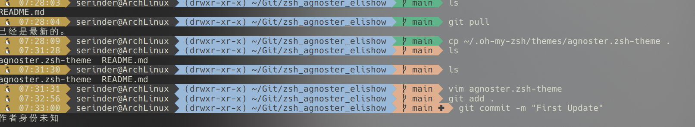
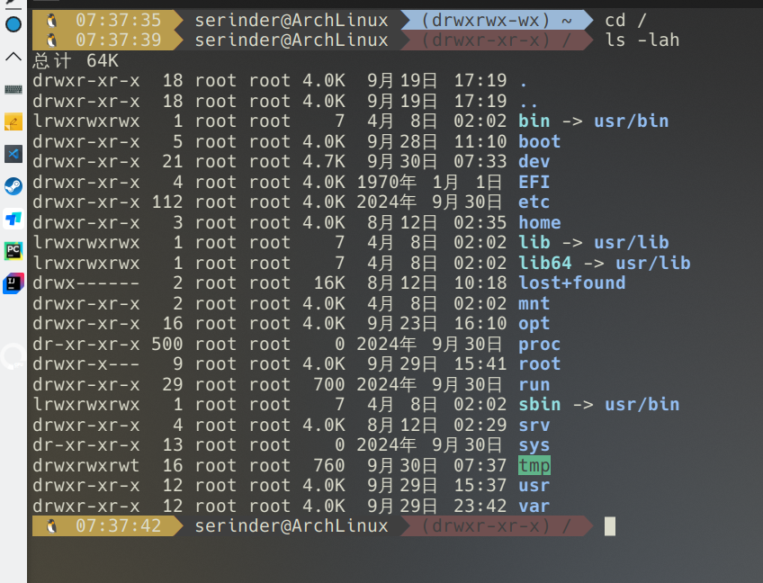

# zsh_agnoster_elishow
Added features and styles to Agnoster to display command execution time, current working directory permissions, and more

base  ` oh-my-zsh`

- [Introduction ](#the-changes-made)
- [Insteall](#install)


# The changes made

* Added a marker for code execution time
 

* Added a display for the current user's permissions on the current working directory: the path is blue when writable and red when not writable, serving as a reminder



# Install

Clone the Git repository. 
```
git clone https://github.com/in-serinder/zsh_agnoster_elishow.git
 ```

You can manually place the Agnoster configuration in your personal directory's ` .zshrc ` (the file is hidden), and then copy agnoster.zsh-theme to `  ~/.oh-my-zsh/themes `. Alternatively, you can run  ` install.sh.`

```
chmod u+x install.sh
./install.sh
```
